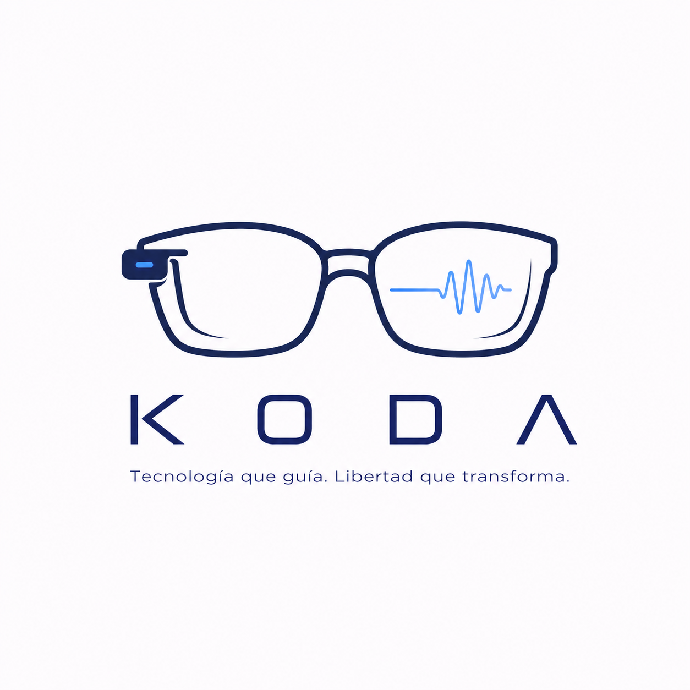

# KODA

### Asistencia Visual con IA para Personas con Discapacidad Visual Severa

---

## Video de demostración

[](https://youtu.be/lmg1QkQfOQk)

**📅 Demo en vivo: 29 de abril de 2026**  
**📍 Campus Universidad de La Sabana, Chía, Colombia**

Para más detalles sobre la demo, visita [`docs/DEMO.md`](docs/DEMO.md).

---

## ¿Qué es KODA?

KODA es un prototipo que proporciona **asistencia visual en tiempo real** para usuarios con discapacidad visual severa. El sistema captura video, detecta objetos y peligros, extrae texto visible, consulta inteligencia artificial multimodal, y describe la escena en voz natural en español.

El usuario también puede hacer preguntas por voz y navegar dentro del campus sin depender de GPS o servicios externos.

**Objetivo:** Que una persona ciega pueda entender su entorno visual y moverse independientemente con confianza.

---

## Arquitecura del sistema

```
┌─────────────────────────────────────────────────────────────┐
│                         ENTRADA                             │
├─────────────────────────────────────────────────────────────┤
│  Cámara Webcam (OpenCV)                                     │
│  Micrófono (Google STT)                                     │
└──────────────────────────────────────────────────────────────┘
                             │
                             ▼
┌─────────────────────────────────────────────────────────────┐
│                      PROCESAMIENTO                          │
├─────────────────────────────────────────────────────────────┤
│  ┌─────────────┐       ┌──────────────┐                     │
│  │ YOLO v8n    │       │ Tesseract    │                     │
│  │ (Detección  │       │ OCR (español)│                     │
│  │  peligros)  │       │   + Lemma)   │                     │
│  └─────────────┘       └──────────────┘                     │
│         │                      │                             │
│         └──────────┬───────────┘                             │
│                    ▼                                         │
│          Pipeline de priorización                           │
│          (peligro crítico > normal)                         │
└─────────────────────────────────────────────────────────────┘
                             │
                             ▼
┌─────────────────────────────────────────────────────────────┐
│                     INTELIGENCIA ARTIFICIAL                 │
├─────────────────────────────────────────────────────────────┤
│  Google Gemini 2.5 Flash                                    │
│  - Imagen + contexto OCR                                    │
│  - Descripción de escena o respuesta conversacional         │
│  - Latencia objetivo: 300-800 ms                            │
└─────────────────────────────────────────────────────────────┘
                             │
                             ▼
┌─────────────────────────────────────────────────────────────┐
│                         SALIDA                              │
├─────────────────────────────────────────────────────────────┤
│  Google Cloud Text-to-Speech Neural2 (español)             │
│  Reproducción de audio (pygame)                             │
│  Ventana visual (OpenCV) con:                               │
│  - Bordes ROJO = peligro inmediato                          │
│  - Bordes VERDE = distancia segura                          │
│  - Contador YOLO (cantidad objetos)                         │
│  - Subtítulos de Gemini                                     │
└─────────────────────────────────────────────────────────────┘
```

---

## Características principales

| Capacidad | Descripción | Estado |
|-----------|-------------|--------|
| **Descripción automática** | Cada 2-3 segundos, sistema describe lo que ve | ✅ Implementado |
| **Detección de peligros** | YOLO identifica objetos peligrosos; OCR alerta de señales críticas | ✅ Implementado |
| **Priorización de alertas** | Alerta crítica interrumpe descripción normal; se reanuda después | ✅ Implementado |
| **Pregunta por voz** | Usuario pregunta "¿Qué es esto?" y recibe respuesta contextual | ✅ Implementado |
| **Navegación por voz** | Usuario dice "¿Cómo llego al bloque G?" y recibe instrucciones | ✅ Implementado (mock) |
| **Navegación paso a paso** | Usuario avanza entre pasos de navegación con "siguiente" | ✅ Implementado (mock) |
| **Video pregrabado** | Demo reproducible con video MP4 en lugar de cámara | ✅ Implementado |
| **Modo offline** | Navegación funciona sin Google Maps (usa mock) | ✅ Implementado |

---

## Setup rápido

### 1. Requisitos previos

**Sistema:**
- **Python 3.11+**
- **Tesseract OCR** instalado en el sistema (no solo pip)
- **Cámara** o **micrófono** (según modo)
- **Conexión a internet** (para APIs de Google)

**Tesseract OCR — Instalación**

**Windows:**
1. Descargar e instalar desde: https://github.com/UB-Mannheim/tesseract-ocr/wiki (descarga el ejecutable `.exe`)
2. Instalar el idioma español:
   - Descargar `spa.traineddata` desde: https://github.com/tesseract-ocr/tessdata_best/raw/main/spa.traineddata
   - Copiar a: `C:\Program Files\Tesseract-OCR\tessdata\`

**Linux (Ubuntu/Debian):**
```bash
sudo apt install tesseract-ocr tesseract-ocr-spa
```

**macOS:**
```bash
brew install tesseract tesseract-lang
```

**Verificación:**
```bash
tesseract --list-langs
```
El output debe incluir `spa`.

### 2. Clonar e instalar dependencias

```bash
git clone https://github.com/[tu-repo]/koda-core.git
cd koda-core
pip install -r requirements.txt
```

### 3. Configurar variables de entorno

```bash
cp .env.example .env
# Editar .env con tus claves de API:
# - GEMINI_API_KEY (Google Gemini)
# - GOOGLE_CLOUD_PROJECT (Google Cloud)
# - GOOGLE_APPLICATION_CREDENTIALS (path a JSON de credenciales)
```

**Variables clave:**

| Variable | Requerida | Propósito |
|----------|-----------|----------|
| `GEMINI_API_KEY` | ✅ Sí | Acceso a Gemini 2.5 Flash |
| `GOOGLE_CLOUD_PROJECT` | ✅ Sí | Identificar proyecto en Google Cloud |
| `GOOGLE_APPLICATION_CREDENTIALS` | ✅ Sí | Path a archivo JSON de credenciales TTS/STT |
| `VIDEO_PATH` | ❌ No | Path a video MP4; si está vacío, usa cámara en vivo |
| `HAZARD_DETECTION_ENABLED` | ❌ No | Activar detección de peligros (default: `true`) |
| `HAZARD_PROXIMITY_THRESHOLD` | ❌ No | Umbral de cercanía (default: `0.05` = 5% del frame) |
| `MOCK_LOCATION_LAT` / `MOCK_LOCATION_LNG` | ❌ No | Coordenadas campus para navegación mock |

**Ejemplo `.env`:**
```env
GEMINI_API_KEY=sk-...
GOOGLE_CLOUD_PROJECT=koda-demo-2026
GOOGLE_APPLICATION_CREDENTIALS=/path/to/service-account.json
FRAME_RATE=1
TTS_LANGUAGE_CODE=es-US
TTS_VOICE_NAME=es-US-Neural2-B
HAZARD_DETECTION_ENABLED=true
HAZARD_PROXIMITY_THRESHOLD=0.05
MOCK_LOCATION_LAT=4.8653
MOCK_LOCATION_LNG=-74.0279
```

### 4. (Opcional) Descargar modelo YOLO

```python
from ultralytics import YOLO
YOLO("yolov8n.pt")  # Descarga ~6 MB, se guarda localmente
```

O permitir que se descargue automáticamente en el primer arranque.

### 5. Ejecutar el sistema

**Con cámara en vivo:**
```bash
python main.py
```

**Con video pregrabado (demo reproducible):**
```bash
# Copiar video a demo/ o especificar en .env:
# VIDEO_PATH=demo/video_demo.mp4
python main.py
```

---

## Estructura del proyecto

```
koda-core/
├── main.py                          # Orquestador principal
├── requirements.txt                 # Dependencias
├── .env.example                     # Template de configuración
├── README.md                        # Este archivo
│
├── docs/
│   ├── DEMO.md                      # Detalles de la demo del 29 de abril
│   ├── CHANGELOG_USER.md            # Historial de cambios funcionales
│   └── README.md                    # Guía de tests
│
├── modules/
│   ├── config.py                    # Carga de variables de entorno
│   ├── prompts.py                   # Prompts de Gemini (clave del sistema)
│   │
│   ├── input/
│   │   ├── camera.py                # Captura de video (OpenCV)
│   │   ├── ocr.py                   # Extracción de texto (Tesseract)
│   │   └── stt.py                   # Speech-to-Text (Google Cloud STT)
│   │
│   ├── processing/
│   │   ├── pipeline.py              # Pipeline principal
│   │   ├── hazard_detector.py       # Detector de peligros (YOLO + OCR)
│   │   └── hazard_rules.py          # Clasificación de criticidad
│   │
│   ├── output/
│   │   ├── gemini_client.py         # Gemini 2.5 Flash API
│   │   ├── tts_client.py            # Text-to-Speech (Google Cloud TTS)
│   │   ├── audio.py                 # Reproducción y cola de prioridades
│   │   └── navigation.py            # Sistema de navegación (mock + real)
│   │
│   └── __init__.py
│
├── tests/
│   ├── test_hazard_rules.py         # Tests de reglas de peligro
│   ├── test_audio_priority.py       # Tests de cola de audio
│   └── README.md                    # Guía de ejecución de tests
│
├── demo/
│   └── [videos pregrabados]         # (Optional) Videos para demo reproducible
│
└── .git/                            # Git repository
```

---

## Stack tecnológico

| Tecnología | Versión | Propósito |
|------------|---------|----------|
| **Python** | 3.11+ | Lenguaje principal |
| **Google Gemini** | 2.5 Flash | IA multimodal (análisis de imagen) |
| **Google Cloud TTS** | Neural2 | Síntesis de voz en español |
| **Google Cloud STT** | v2 | Reconocimiento de voz (streaming) |
| **OpenCV** | 4.x | Captura de video y procesamiento de imágenes |
| **YOLOv8n** | Nano | Detección en tiempo real de objetos |
| **Tesseract OCR** | 5.x | Extracción de texto en español |
| **pygame** | 2.x | Reproducción de audio |
| **PyAudio** | 0.2.x | Captura de micrófono en streaming |
| **python-dotenv** | 1.x | Gestión de variables de entorno |

---

## Decisiones técnicas clave

### 1. Por qué Google Gemini (no Claude, GPT-4)
- **Multimodal nativo:** Procesa imagen + texto simultáneamente
- **Latencia baja:** 300-800 ms es aceptable para tiempo real
- **Económico:** Pricing accesible para prototipo de hackathon
- **Disponible:** API estable y documentada

### 2. Por qué YOLO local (no servidor)
- **Sin latencia de red:** Detector corre en GPU/CPU local
- **Independencia:** Demo funciona sin conexión externa extra
- **Ligero:** Modelo `yolov8n` = 6 MB, ~30-50 ms en CPU

### 3. Por qué OCR incluido
- **Contexto adicional:** Gemini recibe "STOP" de una señal, comprende mejor
- **Alertas críticas:** Si OCR detecta "PELIGRO", interrumpe audio actual
- **Sin ML adicional:** Tesseract es determinístico, rápido, sin red

### 4. Por qué navegación con mock (no Google Maps real)
- **Demo reproducible:** Sin dependencia de GPS o Maps API
- **Offline:** Funciona en cualquier lugar sin conexión
- **Suficiente:** Campus pequeño (1 km²) con 5 destinos principales
- **Escalable:** Fácil agregar más destinos en JSON

### 5. Por qué threading (descripción + conversación en paralelo)
- **Responsividad:** Usuario puede interrumpir descripción automática
- **Naturalidad:** Conversación no se bloquea esperando siguiente frame
- **Arquitectura:** Separación clara de responsabilidades

---

## Flujo de operación

### Modo descripción continua (por defecto)

```
Bucle principal:
1. Capturar frame de cámara/video
2. Ejecutar OCR (paralelo)
3. Ejecutar YOLO (detección de peligros)
4. Evaluar criticidad (peligro crítico > peligro alto > normal)
5. Enviar frame + OCR a Gemini → obtener descripción
6. Sintetizar descripción con TTS
7. Encolar audio con prioridad correcta
8. Reproducir audio (respetando interrupciones por peligro)
9. Esperar N segundos, repetir
```

### Modo conversacional (usuario presiona PTT)

```
Cuando usuario presiona botón PTT:
1. Capturar audio del micrófono
2. Transcribir con Google STT
3. Detectar si es pregunta de navegación o normal
4. Si navegación: usar NavigationClient (mock)
5. Si normal: enviar transcripción + contexto visual a Gemini
6. Sintetizar respuesta con TTS
7. Reproducir
```

---

## Latencia esperada

**Objetivo: < 1.5 segundos desde captura hasta audio para el usuario**

```
Componente                  Min     Típico   Max
─────────────────────────────────────────────────
Captura frame:              30 ms   50 ms    100 ms
OCR (Tesseract):            80 ms   150 ms   300 ms
YOLO (detección):           20 ms   40 ms    100 ms
Red → Gemini API:           100 ms  150 ms   300 ms
Gemini inference:           300 ms  500 ms   800 ms
TTS síntesis:               50 ms   100 ms   200 ms
Reproducción audio:         80 ms   100 ms   150 ms
─────────────────────────────────────────────────
TOTAL E2E:                  660 ms  1090 ms  1950 ms
```

**Cuello de botella:** Google Gemini (40-50% de la latencia total). Lo siguiente es OCR + Red.

**Cómo optimizar:** Usar GPU en Gemini Pro (si disponible), reducir tamaño OCR a región de interés (ROI), caché de prompts.

---

## Equipo

| Nombre | Rol | Responsabilidad |
|--------|-----|-----------------|
| **Mao** | Product Lead | Visión, iteración de prompts, evaluación |
| **Nicolás** | Input Engineer | Cámara, OCR, captura de datos |
| **Thomas** | Output Engineer | Gemini, TTS, STT, pipeline de salida |

---

## Testing

Ejecutar pruebas unitarias:

```bash
python -m pip install pytest
python -m pytest -q
```

Para más detalles, ver [`tests/README.md`](tests/README.md).

---

## Documentación adicional

- **[`docs/DEMO.md`](docs/DEMO.md)** — Detalles técnicos y visuales de la demo del 29 de abril
- **[`docs/CHANGELOG_USER.md`](docs/CHANGELOG_USER.md)** — Historial de cambios y decisiones arquitectónicas
- **[`mock.md`](mock.md)** — Sistema completo de navegación mock (sin Google Maps)
- **[`context.md`](context.md)** — Contexto interno de desarrollo (para el equipo)

---

## Licencia

Prototipo desarrollado para hackathon. Código disponible bajo licencia MIT (si aplica).

---

## Roadmap post-demo

**Después del 29 de abril:**

- Integrar GPS real para navegación en tiempo real
- Reemplazar palabras clave con NLU (Vertex AI Natural Language)
- Agregar caché offline de descripciones frecuentes
- Integrar Google Maps real para distancias exactas
- Detección de "llegada" con acelerómetro
- Interfaz móvil (app Android/iOS nativa)
- Auriculares de conducción ósea certificados
- Evaluación con usuarios reales

**Ahora:** La demo funciona. El 29 de abril demostramos.
